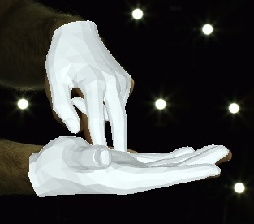
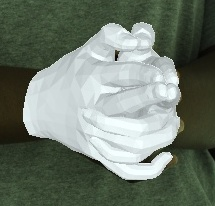
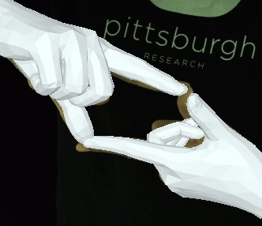
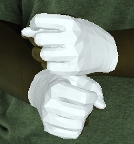
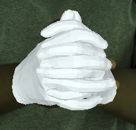
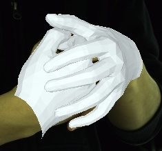
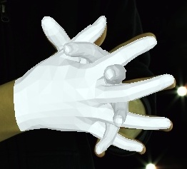

# InterHand2.6M: A Dataset and Baseline for 3D Interacting Hand Pose Estimation from a Single RGB Image

## Our new Re:InterHand dataset has been released, which has much more diverse image appearances with more stable 3D GT. Check it out at [here](https://mks0601.github.io/ReInterHand)!

## Introduction
* This repo is official **[PyTorch](https://pytorch.org)** implementation of **[InterHand2.6M: A Dataset and Baseline for 3D Interacting Hand Pose Estimation from a Single RGB Image (ECCV 2020)](https://arxiv.org/abs/2008.09309)**. 
* Our **InterHand2.6M dataset** is the first large-scale real-captured dataset with **accurate GT 3D interacting hand poses**.
* Videos of 3D joint coordinates (from joint_3d.json) from the 30 fps split: [[single hand](https://drive.google.com/drive/folders/1njp3jgpk2EnGek1Sz3P6LE4K1rp-jG97?usp=sharing)] [[two hands](https://drive.google.com/drive/folders/1VGwUSf88_fGjWcQv4DlTaOe6wAWgS1Bq?usp=share_link)].
* Videos of MANO fittings from the 30 fps split: [[single hand](https://drive.google.com/drive/folders/1ALrcaH3foRUVObUAwwa_5i8yJqrNu7jr?usp=sharing)] [[two hands](https://drive.google.com/drive/folders/1HZZy9pIiJcyIkmYQzCvg6i0RxCog-Usp?usp=share_link)].

<p align="middle">
    
</p>
<p align="middle">
    
</p>
<p align="center">
Above demo videos have low-quality frames because of the compression for the README upload.
</p>
<p align="middle">

</p>

## News
* 2021.06.10. Boxs in RootNet results are updated to be correct.
* 2021.03.22. Finally, InterHand2.6M v1.0, which includes *all images of 5 fps and 30 fps version*, is released! :tada: This is the dataset used in InterHand2.6M paper.
* 2020.11.26. Demo code for a random image is added! Checkout below instructions.
* 2020.11.26. Fitted MANO parameters are updated to the better ones (fitting error is about 5 mm). Also, reduced to much smaller file size by providing parameters fitted to the world coordinates (independent on the camera view).
* 2020.10.7. Fitted MANO parameters are available! They are obtained by [NeuralAnnot](https://arxiv.org/abs/2011.11232).

## InterHand2.6M dataset
* For the **InterHand2.6M dataset download and instructions**, go to [[HOMEPAGE](https://mks0601.github.io/InterHand2.6M/)].
* Belows are instructions for **our baseline model**, InterNet, for 3D interacting hand pose estimation from a single RGB image.

## Demo on a random image
1. Download pre-trained InterNet from [here](https://drive.google.com/file/d/15Akkzf1AvKm6iKYQGPhBfGLSeF9DPiFZ/view?usp=sharing)
2. Put the model at `demo` folder
3. Go to `demo` folder and edit `bbox` in [here](https://github.com/facebookresearch/InterHand2.6M/blob/5de679e614151ccfd140f0f20cc08a5f94d4b147/demo/demo.py#L74)
4. run `python demo.py --gpu 0 --test_epoch 20`
5. You can see `result_2D.jpg` and 3D viewer.

## MANO mesh rendering demo
1. Install [SMPLX](https://github.com/vchoutas/smplx)
2. `cd tool/MANO_render`
3. Set `smplx_path` in `render.py`
3. Run `python render.py`

## MANO parameter conversion from the world coordinate to the camera coordinate system
1. Install [SMPLX](https://github.com/vchoutas/smplx)
2. `cd tool/MANO_world_to_camera/`
3. Set `smplx_path` in `convert.py`
3. Run `python convert.py`

## Camera positions visualization demo
1. `cd tool/camera_visualize`
2. Run `python camera_visualize.py`
* As there are *many* cameras, you'd better set `subset` and `split` in line 9 and 10, respectively, by yourself.

## Directory

### Root
The `${ROOT}` is described as below.
```
${ROOT}
|-- data
|-- common
|-- main
|-- output
```
* `data` contains data loading codes and soft links to images and annotations directories.
* `common` contains kernel codes for 3D interacting hand pose estimation.
* `main` contains high-level codes for training or testing the network.
* `output` contains log, trained models, visualized outputs, and test result.

### Data
You need to follow directory structure of the `data` as below.
```
${ROOT}
|-- data
|   |-- STB
|   |   |-- data
|   |   |-- rootnet_output
|   |   |   |-- rootnet_stb_output.json
|   |-- RHD
|   |   |-- data
|   |   |-- rootnet_output
|   |   |   |-- rootnet_rhd_output.json
|   |-- InterHand2.6M
|   |   |-- annotations
|   |   |   |-- train
|   |   |   |-- test
|   |   |   |-- val
|   |   |-- images
|   |   |   |-- train
|   |   |   |-- test
|   |   |   |-- val
|   |   |-- rootnet_output
|   |   |   |-- rootnet_interhand2.6m_output_test.json
|   |   |   |-- rootnet_interhand2.6m_output_test_30fps.json
|   |   |   |-- rootnet_interhand2.6m_output_val.json
|   |   |   |-- rootnet_interhand2.6m_output_val_30fps.json
```
* Download InterHand2.6M data [[HOMEPAGE](https://mks0601.github.io/InterHand2.6M/)]
* Download STB parsed data [[images](https://www.dropbox.com/sh/ve1yoar9fwrusz0/AAAfu7Fo4NqUB7Dn9AiN8pCca?dl=0)] [[annotations](https://github.com/facebookresearch/InterHand2.6M/releases/download/v1.0/STB.annotations.zip)]
* Download RHD parsed data [[images](https://lmb.informatik.uni-freiburg.de/resources/datasets/RenderedHandposeDataset.en.html)] [[annotations](https://github.com/facebookresearch/InterHand2.6M/releases/download/v1.0/RHD.annotations.zip)]
* All annotation files follow [MS COCO format](http://cocodataset.org/#format-data).  
* If you want to add your own dataset, you have to convert it to [MS COCO format](http://cocodataset.org/#format-data).  

### Output
You need to follow the directory structure of the `output` folder as below.
```
${ROOT}
|-- output
|   |-- log
|   |-- model_dump
|   |-- result
|   |-- vis
```
* `log` folder contains training log file.
* `model_dump` folder contains saved checkpoints for each epoch.
* `result` folder contains final estimation files generated in the testing stage.
* `vis` folder contains visualized results.

## Running InterNet
### Start
* In the `main/config.py`, you can change settings of the model including dataset to use and which root joint translation vector to use (from gt or from [RootNet](https://github.com/mks0601/3DMPPE_ROOTNET_RELEASE)).

### Train
In the `main` folder, run
```bash
python train.py --gpu 0-3
```
to train the network on the GPU 0,1,2,3. `--gpu 0,1,2,3` can be used instead of `--gpu 0-3`. If you want to continue experiment, run use `--continue`. 


### Test
Place trained model at the `output/model_dump/`.

In the `main` folder, run 
```bash
python test.py --gpu 0-3 --test_epoch 20 --test_set $DB_SPLIT
```
to test the network on the GPU 0,1,2,3 with `snapshot_20.pth.tar`.  `--gpu 0,1,2,3` can be used instead of `--gpu 0-3`. 

`$DB_SPLIT` is one of [`val`,`test`].
* `val`: The validation set. `Val` in the paper.
* `test`: The test set. `Test` in the paper.

## Results  
Here I provide the performance and pre-trained snapshots of InterNet, and output of the [RootNet](https://github.com/mks0601/3DMPPE_ROOTNET_RELEASE) as well. 
### Pre-trained InterNet
* [[Trained on InterHand2.6M 5 fps (v1.0)](https://drive.google.com/file/d/15Akkzf1AvKm6iKYQGPhBfGLSeF9DPiFZ/view?usp=sharing)]
* [[Trained on STB](https://drive.google.com/file/d/1DVsYnpj31l7TGtYwOWBX6zPIonj_3Xz5/view?usp=sharing)]
* [[Trained on RHD](https://drive.google.com/file/d/1_UcYwE6E0-6Xs8Wg4KSzeFJ1QZE3Vjnl/view?usp=sharing)]
### RootNet output
* [[Output on InterHand2.6M](https://drive.google.com/drive/folders/1qaS67WjwKb1b-QHv9nlHNq7Tkl9TjmzV?usp=sharing)]
* [[Output on STB](https://drive.google.com/file/d/1E0CyRCIUDEecRZbMlIzsMEXBg65JuBJl/view?usp=sharing)]
* [[Output on RHD](https://drive.google.com/file/d/14DnurnMZOpfZtMpj-hn-Iw3GQbvkEPxP/view?usp=sharing)]
### RootNet codes
* [Codes](https://drive.google.com/drive/folders/1reXntog5o551DKRa1_6E8caHHbbCppz0?usp=sharing)
* See [RootNet](https://github.com/mks0601/3DMPPE_ROOTNET_RELEASE) for the code instructions.

## Reference  
```  
@InProceedings{Moon_2020_ECCV_InterHand2.6M,  
author = {Moon, Gyeongsik and Yu, Shoou-I and Wen, He and Shiratori, Takaaki and Lee, Kyoung Mu},  
title = {InterHand2.6M: A Dataset and Baseline for 3D Interacting Hand Pose Estimation from a Single RGB Image},  
booktitle = {European Conference on Computer Vision (ECCV)},  
year = {2020}  
}  
```

## License
InterHand2.6M is CC-BY-NC 4.0 licensed, as found in the LICENSE file.

[[Terms of Use](https://opensource.facebook.com/legal/terms)]
[[Privacy Policy](https://opensource.facebook.com/legal/privacy)]
